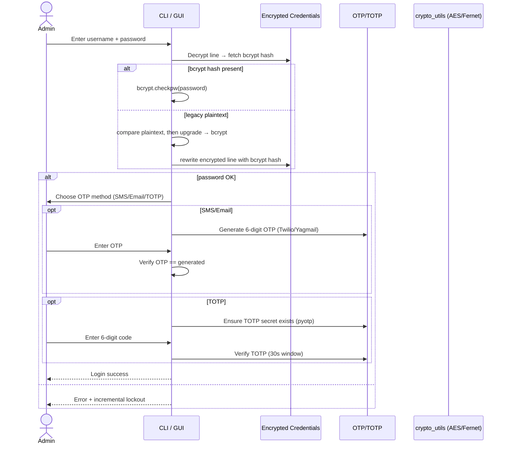
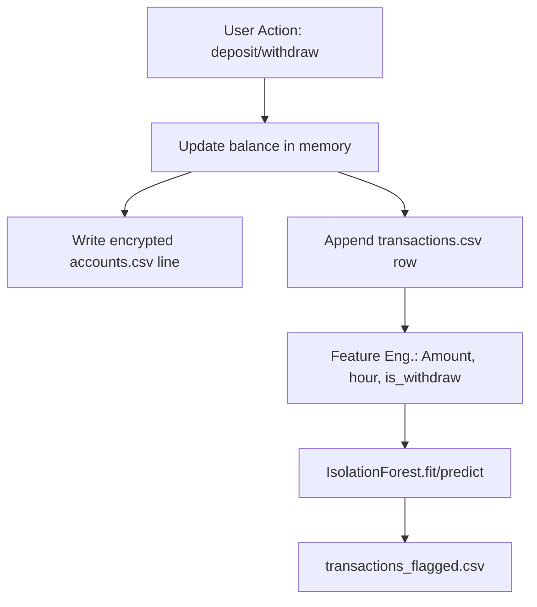
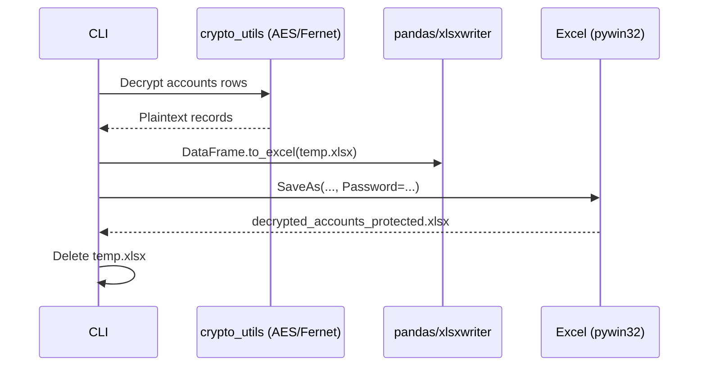

# IntelliSecureBank – Architecture & Workflows

_Last updated: 2025-10-03 18:34_

This document explains the **overall system design**, **data flow**, and **key workflows** (Auth, KYC, Transactions/Anomaly, Export).  
All diagrams are written in **Mermaid** which GitHub renders natively.


---

## 1) System Overview

**Goal:** A secure CLI/GUI banking system that combines **MFA**, **KYC (OCR + FaceID)**, **Encrypted storage**, and **Anomaly detection**.

### Components

- **CLI Core (`intell.py`)**: Business logic + menu flows.
- **GUI (optional)**: `gui_app_pro_ui_plus.py` (Tkinter) layered on top of backend.
- **Auth Store**: `admin_credentials.txt` (line-encrypted) with **bcrypt** password hashes and **TOTP** secrets (in `totp_secrets/`).
- **KYC**: OCR via **Tesseract**; face embedding via **OpenCV DNN + OpenFace .t7**; compares passport vs. webcam.
- **Accounts & Transactions**: Encrypted `accounts.csv` (Fernet/AES via `crypto_utils.py`), raw `transactions.csv`.
- **Anomaly Detection**: `IsolationForest` trained on engineered features.
- **Exports**: Encrypted Excel (COM-based password) and **PDF statements** (ReportLab).
- **OTP Delivery**: Twilio SMS or email (yagmail / SMTP).

### High-Level Architecture

```mermaid
flowchart TB
  subgraph Client
    CLI[IntelliSecureBank CLI]:::node
    GUI[Admin GUI (Tkinter)]:::node
  end

  subgraph Security
    Creds[admin_credentials.txt<br/>(encrypted lines + bcrypt)]:::store
    TOTP[totp_secrets/<user>.txt<br/>(TOTP secret + QR)]:::store
    Crypto[crypto_utils.py<br/>AES/Fernet]:::svc
  end

  subgraph KYC
    OCR[pytesseract OCR]:::svc
    Face[OpenCV DNN + OpenFace .t7<br/>embed + compare]:::svc
    Models[models/: .prototxt, .caffemodel, .t7]:::store
  end

  subgraph Data
    Accounts[accounts.csv (encrypted rows)]:::store
    Txn[transactions.csv]:::store
    Flags[transactions_flagged.csv]:::store
    PDFDir[statements/*.pdf]:::store
    Excel[decrypted_accounts_protected.xlsx]:::store
  end

  subgraph Services
    OTP[Twilio / Email OTP]:::svc
    Anom[IsolationForest]:::svc
    PDF[ReportLab PDF Export]:::svc
    ExcelExport[Excel Export + pywin32]:::svc
  end

  CLI -->|calls| Crypto
  GUI -->|calls| Crypto

  CLI -->|login/register| Creds
  GUI -->|login/register| Creds
  Creds <-->|TOTP| TOTP

  CLI -->|KYC| OCR
  CLI -->|KYC| Face
  Face --> Models

  CLI --> Accounts
  CLI --> Txn
  CLI --> Anom --> Flags

  CLI --> PDF --> PDFDir
  CLI --> ExcelExport --> Excel

  OTP -.-> CLI
  OTP -.-> GUI

  classDef node fill:#2563eb,stroke:#0b3b8a,stroke-width:1,color:#fff
  classDef store fill:#f5f7fa,stroke:#a5b4c7,stroke-width:1,color:#0f172a
  classDef svc fill:#22c55e,stroke:#146c2e,stroke-width:1,color:#052e12
```

---

## 2) Authentication (Password + OTP/TOTP)

### Flow



---

## 3) KYC (OCR + Face Verification)

```mermaid
flowchart LR
  ID[ID Image] --> OCR[pytesseract]
  OCR -->|text lines| Match[Fuzzy Match (difflib)]
  subgraph Face Match
    P[Passport Photo] --> Emb1[Embed (OpenFace)]
    Cam[Webcam Live] --> Emb2[Embed (OpenFace)]
    Emb1 --> Dist[L2 Distance]
    Emb2 --> Dist
  end
  Match --> Decision{{Name ≥ 0.6?}}
  Dist --> Decision2{{Distance < 0.6?}}
  Decision -- yes --> Decision2
  Decision -- no --> Reject
  Decision2 -- yes --> Approve
  Decision2 -- no --> Retry/Reject
```

---

## 4) Accounts, Transactions & Anomaly Pipeline

### Data Model (simplified ER)

```mermaid
erDiagram
  ACCOUNT ||--o{ TRANSACTION : has
  ACCOUNT {{
    int accNo PK
    string name
    char type  "S or C"
    int balance
  }}
  TRANSACTION {{
    datetime timestamp
    int AccountNo FK
    string TransactionType  "deposit/withdraw/create"
    float Amount
  }}
```

### Pipeline



---

## 5) Export Pipelines

### A) Excel (Password-Protected)



### B) PDF Statement (ReportLab)

```mermaid
flowchart TB
  Load[Load transactions.csv] --> Filter[Filter by Account + Date Range]
  Filter --> Opening[Compute Opening Balance]
  Opening --> Rows[Compute running balance]
  Rows --> Table[Build PDF Table (ReportLab)]
  Table --> Save[Write statements/ACC_PERIOD.pdf]
```

---

## 6) Security Summary
- At-rest: **AES/Fernet** for `accounts.csv` lines.
- Passwords: **bcrypt** (+ legacy auto-upgrade).
- MFA: **OTP (SMS/Email)** or **TOTP** with Authenticator apps.
- Lockout: 5 failed attempts → 5 minutes.
- KYC: OCR + Face embedding compare (threshold 0.6).
- Secrets via `.env` (Twilio/Gmail).

---

## 7) Troubleshooting
- OpenCV DNN model missing → check `models/` files.
- Tesseract missing → install & ensure PATH.
- pywin32 COM errors → MS Excel must be installed.
- Twilio trial → verify phone numbers.
- Gmail → use **App Password**.

---

## 8) Roadmap
- Add liveness checks.
- Move accounts/txns to SQLite with encryption.
- Streamlit dashboard for anomalies.
- REST API + React frontend.
